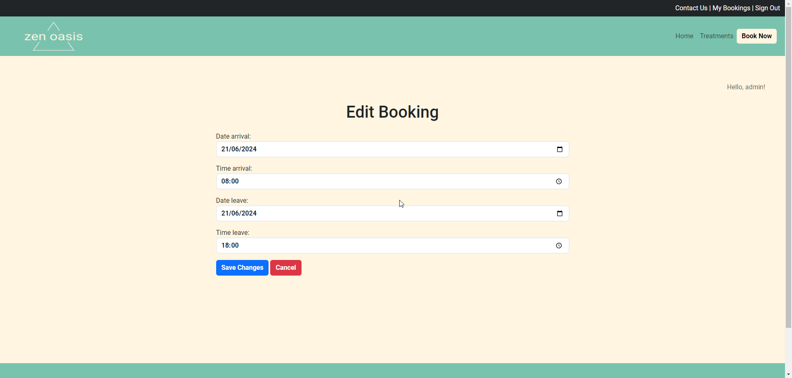

# Zen Oasis Spa

Welcome to Zen Oasis Spa, your ultimate sanctuary for relaxation and rejuvenation. Nestled in a serene corner of the city, Zen Oasis Spa offers a tranquil escape from the hustle and bustle of everyday life. Here, every detail is meticulously crafted to provide you with an unparalleled spa experience, ensuring that your mind, body, and spirit are harmoniously balanced.

Zen Oasis is an all-inclusive 24-hour spa that charges by the hour. All services are included.

Visit the deployed website here → [Zen Oasis Spa](https://zen-oasis-spa-5b31090aaae5.herokuapp.com/) 
The Epics and User Stories you can see here → [GitHub Project](https://github.com/users/enniovilla/projects/3)

## Content

* [User Experience](#user-experience-ux)
    * [Site Objectives](#site-objectives)
    * [User Stories](#user-stories)
* [Design](#design)
    * [Website Structure](#website-structure)
    * [Wireframes](#wireframes)
    * [Color Scheme](#color-scheme)
    * [Typography](#typography)
* [Features and Future Features](#features-and-future-features)
    * [Features](#features)
    * [Future Features](#future-features)
* [Technologies Used](#technologies-used)
* [Deployment, Fork and Clone](#deployment-fork-and-clone)
    * [Deployment](#deployment)
    * [Fork](#how-to-fork)
    * [Clone](#how-to-clone)
* [Testing](#testing)
* [Bugs](#bugs)
    * [Known Bugs](#known-bugs)
* [Credits](#credits)
* [Content](#content)
* [Media](#media)
* [Acknowledgments](#acknowledgments)

## User Experience (UX)

### Site Objectives

With the creation of this website I aim to make life easier for clients who want to spend some quiet time in a spa. By booking online, the customer just has to go to our spa and enjoy the time. On the website, customers can also check out all the services we offer.

### User Stories

#### First Time User

* I want to relax.
* I want to disconnect from the world.
* I want to see what kind of services I can find at a spa.
* I want to book a day to go to the spa.

#### Returning User

* I want to check new treatments the spa has to offer.
* I want to contact the establishment.
* I want to sign up and book a date.

#### Frequent User

* I want to book new dates to go back.

[Back to top](<#content>)

## Design

### Website Structure

My plan was much bigger than I really thought I could do. I didn't expect the fourth Code Institute project to be so extensive and complicated, I hope I can deliver and I say that because it's 5 o'clock in the morning, I haven't slept yet and today is my deadline, but that said, you'll see that the final product came out with less content than what I put in the wireframes, but what matters is that I managed to do a cohesive job!

This website consists of a home page, a treatment page, a booking page, a login page, a registration page, a contact page and a page for users to manage their bookings.

### Wireframes

Figma was the software I opted to create the wireframes. I created wireframes for mobile and desktop. Click on the button below to see them.

Wireframes

  
Home page 

  
Discover Zen Oasis page - This page I ended up merging with the index page because of the redundant content. 

  
Treatments/Services page 

  
Booking page 

  
Contact page 

  
Sign In page 

  
Sign Up page 

  
My Bookings page 

 

[Back to top](<#content>)

### Color Scheme

This website has two main colors, `#78C2AD` being the primary and `#FFF5E0` the secondary, in addition to the black color `#000000` as the font color, the top bar above the navigation bar and details. The color `#609C8B` was used to make some hover effects.

Some other singular colors also appear in the project, such as the colors of the standard Bootstrap buttons.

[Back to top](<#content>)

### Flow Diagram

This is a very basic flow diagram about the flow an user and an admin could have when using the website.

[Back to top](<#content>)

### Entity Relationship Diagram

The ERD is pretty simple too, thanks to my bad time management.

[Back to top](<#content>)

### Typography

The font I chose to use was [Roboto](https://fonts.google.com/specimen/Roboto) from Google Fonts and as a fall back font, sans-serif.

[Back to top](<#content>)

## Features and Future Features

### Features

This is a multi-page website and all of them are responsive. On each page we have:

- A favicon. 

- A navigation bar with clickable logo and names that will take the user to the home page and the menu with sign up button highlighted to facilitate the user experience. If the user can scroll down, the navigation bar will be fixed at the top of the screen for easy access. There is a top bar on top of the navigation bar with the login navigation source.

- A footer with social media icons that lead to external pages and to my github page in case you click my name.

[Back to top](<#content>)

### The Home Page

On the home page the user can see a carousel with pictures of clients enjoying their times in the spa and also a welcome text, as well as seeing the navigation bar.

[Back to top](<#content>)

### The Treatments Page

On this page the user will find the treatments the spa has to offer, they are in accordions to improve user experience.

[Back to top](<#content>)

### The Contact Page

The user will find a contact form on this page.

[Back to top](<#content>)

### Sign In Page

A page where the user can log in to their account.

[Back to top](<#content>)

### Sign Up Page

The user can sign up here.

[Back to top](<#content>)

### Book Now Page

This page will take you to the login page in case you are not logged in, but in case you are, you are redirected to the booking page. A small detail is that if you are logged in, at the top right of the screen, below the navigation bar, you can see a message "Hello, username" and this message is seen from every page of the website.

[Back to top](<#content>)

### Booking Successful Page

The user will be able to see a page with a message informing them the booking was made. This message will also show details about the booking. In case the user cannot make the booking because of date mistakes or something else, he will be notified with an alert and won't be able to proceed.

[Back to top](<#content>)

### My Bookings Page

On this page the user will be able to see bookings details, edit and delete their bookings. If the user has no bookings, they will see a message informing them about it.

[Back to top](<#content>)

### Edit & Delete Booking Pages
Whenever the user tries to edit or delete a booking, they will be notified if they succeeded. In case of editing a booking, if there is something wrong, they will also be notified.

[Back to top](<#content>)

### Sign Out Page
Last but not least we have the logout page that takes the user to the home page after successfully logging out

[Back to top](<#content>)

### Future Features

- I would like to have a better booking system, so the user can book singular treatments.
- I would like to have a payment system integrated to the booking system, so the user can pay ahead and don't have to worry about it later.
- I would like to have a fully functional authentication system, where users can recover their passwords and get messages on their emails.

[Back to top](<#content>)

## Technologies Used

- HTML5 to create the website structure.
- CSS3 to style the website.
- JavaScript to create the interactions on the website.
- [Python](https://www.python.org/) + [Django](https://www.djangoproject.com/) to create the fullstack project.
- [Git](https://git-scm.com/) for version control.
- [GitPod](https://www.gitpod.io/) as IDE to create the website.
- [GitHub](https://github.com/) to store files for the website.
- [Figma](https://www.figma.com/) to create the wireframes.
- [Chat GPT](https://chat.openai.com/) to generate fictional texts.
- [Google Fonts](https://fonts.google.com/) to import the font used on the website.
- [Logo](https://logo.com/) to create favicon.
- [Am I Responsive?](https://ui.dev/amiresponsive) to display the website image across various devices.
- [Appetize.io](https://appetize.io/) to simulate the iOS environment.
- [PostgreSQL](https://www.postgresql.org/) through Code Institute databases.
- [Python Tutor](https://pythontutor.com/) to debug my code.
- [Python Validator](https://pep8ci.herokuapp.com/#) by Code Institute to catch some errors and validate my code.
- [Lucidchart](https://www.lucidchart.com/) to create the flowcharts.
- [Heroku](https://www.heroku.com/) to deploy this project.
- [Cloudinary](https://cloudinary.com/) to store the images uploaded on the website.

[Back to top](<#content>)

## Deployment, Fork and Clone

### Deployment

The application has been deployed from GitHub to Heroku by following the steps:

1. Create or log in to your account at [Heroku](https://www.heroku.com/).
2. Create a new app, add a unique app name and then choose your region.
3. Click on Create App.
4. Go to "Settings".
5. Under Config Vars add a key "PORT" and value "8000".
6. Add required buildpacks (further dependencies). For this project, set it up so Python will be on top and Node.js on bottom.
7. Go to "Deploy" and select "GitHub" in "Deployment method".
8. To connect Heroku app to your Github repository code enter your repository name, click "Search" and then "Search" when it shows below.
9. Choose the branch you want to build your app from.
10. If preferred, click on "Enable Automatic Deploys", which keeps the app up to date with your GitHub repository.
11. Wait for the app to build. Once ready you will see the “App was successfully deployed” message and a "View" button to take you to your deployed link.

[Back to top](<#contents>)

### How to Fork

1. Log in to GitHub.
2. Go to the repository for the project.
3. Click the Fork button in the top right corner.

### How to Clone

1. Log in to GitHub.
2. Go to the repository for the project.
3. Click on the **green code button** and select if you would like to clone with HTTPS, SSH or GitHub CLI and copy the link below.
4. Navigate to the directory where you want to clone the repository and open terminal.
5. Type *git clone* into the terminal and paste the link you have from number 3. Press enter. This command will download the entire repository to your local machine.

[Back to top](<#content>)

## Testing

Performed tests can be found in [TESTING.md](TESTING.md).

[Back to top](<#content>)

## Bugs

### Known Bugs

- Sometimes the confirmation alert that you logged in or out successfully pops up next time you change the page.
- The style of inputs on sign in and sign up pages.

[Back to top](<#content>)

## Credits

- All the features of my website were developed with the guidance of the lessons from the Code Institute's I Think Therefore I Blog project.
- This particular [video](https://www.youtube.com/watch?v=-9dhCQ7FdD0&t=1410s) made me understand the logic behind reservation systems.
- With [this other video](https://www.youtube.com/watch?v=I2-JYxnSiB0) I could learn how to render calendars on my html.
- [Django's documentation](https://docs.djangoproject.com/en/5.0/) has become my best friend alongside [W3Schools](https://www.w3schools.com/).

## Content

- The spa home page text and treatments descriptions were generated by [Chat GPT](https://chat.openai.com/).
- I was having trouble building the booking system, until [Denis](https://github.com/dhardi) shared on Code Institute's Slack that he wanted a review of his project, which although it was another topic, also involved a booking system and although the work wasn't finished, it helped me A LOT.

## Media

The images were taken from [Pexels](https://www.pexels.com/).

- [First image on carousel](https://www.pexels.com/photo/woman-in-white-tank-top-lying-on-gray-bed-3673941/)
- [Second image on carousel](https://www.pexels.com/photo/woman-doing-facial-mask-3212179/)
- [Third image on carousel](https://www.pexels.com/photo/woman-in-bathrobe-applying-cream-on-leg-5938595/)
- [Booking successful image](https://www.pexels.com/photo/happy-women-with-cosmetic-masks-on-face-3851696/)

## Acknowledgments

I would like to acknowledge:
- Kay Welfare - My cohort facilitator who's always there for us.
- Jubril Akolade - My Code Institute mentor for understanding my struggles and always giving me nice suggestions.
- My friends who are supporting me and understand if I can't hang out with them because I need to finish my project.
- [Denis](https://github.com/dhardi) you literally saved me two days before my project submission.
- My mom. Just because she's my mom. Love you!!!

[Back to top](<#content>)