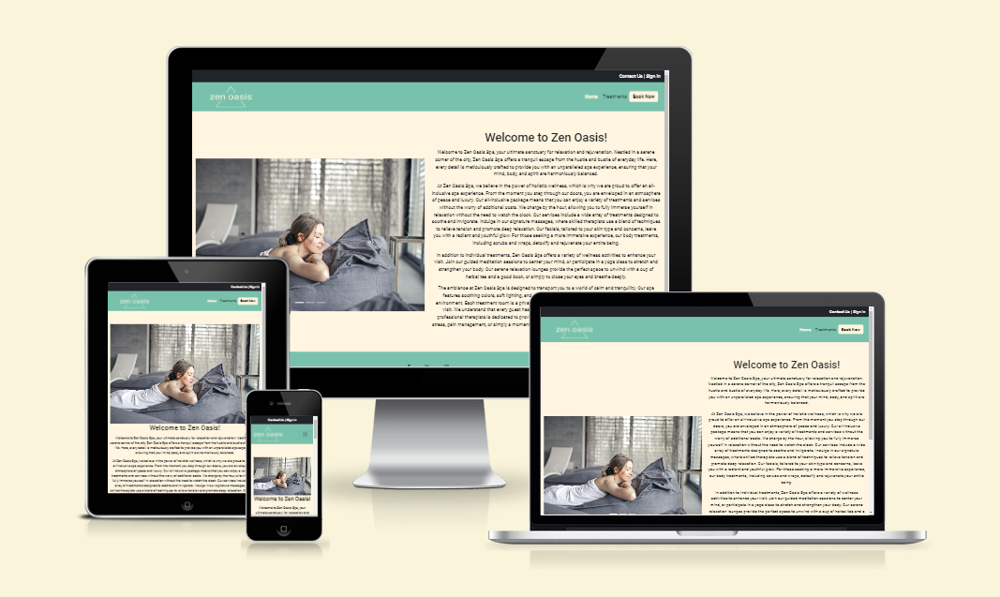
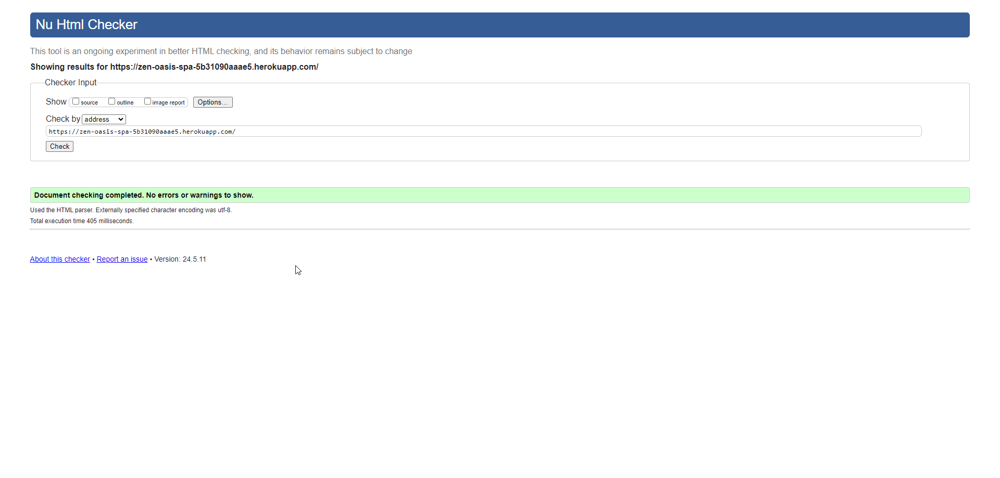
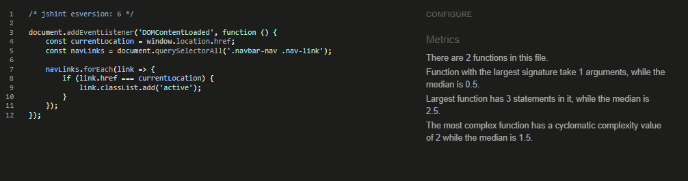

# Zen Oasis Spa Website - Testing

Visit the deployed website here → [Zen Oasis Spa](https://zen-oasis-spa-5b31090aaae5.herokuapp.com/)

## Content

- [Testing User Stories](#testing-user-stories)
- [Manual Testing](#manual-testing)
  - [Browser Testing](#browser-testing)
- [Automated Testing](#automated-testing)
  - [HTML Validator](#html-validator)
  - [CSS Validator](#css-validator)
  - [JavaScript Validator](#javascript-validator)
  - [Python Validation](#python-validation)
  - [Lighthouse](#lighthouse)

## Testing User Stories

- First time visitors

| Expectation                                              | Result                                                                                                                                        |
| :------------------------------------------------------- | :-------------------------------------------------------------------------------------------------------------------------------------------- |
| I want to go to spa.                                     | I created a website that is very easy to understand its purpose from the moment the page loads. The user gets to informations really quickly. |
| I want to relax.                                         | I created a website that displays the offered treatments, so the user can prepare to relax.                                                   |
| I want to see what kind of services I can find at a spa. | This is easily solved by looking at the navigation bar.                                                                                       |
| I want responsiveness from my website.                   | The website has full responsiveness.                                                                                                          |

 
- Returning Visitors

| Expectation                                          | Result                                                                                  |
| :--------------------------------------------------- | :-------------------------------------------------------------------------------------- |
| I want to check new treatments the spa has to offer. | The user can see new treatments by clicking on the accordions.                          |
| I want to contact the establishment.                 | The user can see the contact form on the top bar above the navigation bar.              |
| I want to sign up and book a date.                   | The user can see the "book now" button on the navigation bar as soon as the page loads. |

[Back to top](#content)

## Manual Testing

| Feature                                                                     | Expectation                                                                   | Action                                                        | Result |
| --------------------------------------------------------------------------- | ----------------------------------------------------------------------------- | ------------------------------------------------------------- | ------ |
| Carousel                                                                    | If you click on the arrow, the picture is supposed to go to the next one      | Click the arrows                                              | Passed |
| Navbar buttons                                                              | Take the user to the respective section                                       | Click buttons                                                 | Passed |
| Treatment accordions                                                        | Open and close when clicked                                                   | Click on accordion title                                      | Passed |
| Book now button                                                             | Go to the booking page. If user not signed in, ask to sign in                 | Click on the button                                           | Passed |
| Top bar                                                                     | Change the menu when a user signs in/out                                      | Sign in/out                                                   | Passed |
| Contact form                                                                | Send a message to the admins panel                                            | Send a message                                                | Passed |
| Booking page                                                                | You can book a date and time                                                  | Select date and time                                          | Passed |
| Edit booking                                                                | Change booking's date and/or time                                             | Click edit button                                             | Passed |
| Delete booking                                                              | Delete a booking                                                              | Click delete button                                           | Passed |
| Logout                                                                      | Signs out of the account                                                      | Click the button                                              | Passed |
| Account creation                                                            | Create account                                                                | Fill out the form                                             | Passed |
| Bookings in the past                                                        | User can't book a past time                                                   | Try to book in the past                                       | Passed |
| User knows they're signed in                                                | Display user name on the screen after sign in                                 | Look at the screen                                            | Passed |
| Empty, false or wrong values                                                | Forms don't allow empty or false values                                       | Try to submit a form with empty inputs, wrong characters, etc | Passed |
| Footer links open externally                                                | Footer links open externally                                                  | Click on the links in the footer                              | Passed |
| Carousel doesn't play automatically because it's not good for accessibility | Carousel doesn't play automatically                                           | Wait and see if the carousel moves (it doesn't)               | Passed |
| Success message                                                             | User get a sucess message after submit any form (login, signup, booking, etc) | Submit a form                                                 | Passed |
| Admin panel                                                                 | Admin can manage and edit informations, images and delete things              | Edit informations, update images, delete things               | Passed |

 

### Browser Testing

I tested the website in different browsers, both on computer and mobile. iOS tests were made on [Appetize.io](https://appetize.io/).

| Browser         | Result                     |
| :-------------- | :------------------------- |
| Google Chrome   | The website is responsive. |
| Microsoft Edge  | The website is responsive. |
| Mozilla Firefox | The website is responsive. |
| Opera           | The website is responsive. |
| Safari          | The website is responsive. |

[Back to top](#content)

## Automated Testing

### HTML Validator

[W3C](https://validator.w3.org/) checked the HTML of the website and it passed the validation. A warning message shows up in due to importing the font from Google Fonts.

### CSS Validator

The CSS was validated by [W3C Jigsaw](https://jigsaw.w3.org/css-validator/) and passed the test. To see the full result, click on the name below.

- [CSS](documentation/pdf/css_validator.pdf)

### JavaScript Validator

[JSHint](https://jshint.com/) was used to validate the JavaScript. The validation passed. 

### Python Validation

[PEP8](https://pep8ci.herokuapp.com/) found some issues and I fixed them all.

### Lighthouse

I used [PageSpeed Insights](https://pagespeed.web.dev/) to test the full performance of the website.  

- Mobile

[Index](documentation/images/lighthouse/mobile-index.png) 

[Treatments](documentation/images/lighthouse/mobile-treatments.png) 

[My Booking](documentation/images/lighthouse/mobile-my_booking.png) 

[Logout](documentation/images/lighthouse/mobile-logout.png) 

[Login](documentation/images/lighthouse/mobile-login.png) 

[Contact](documentation/images/lighthouse/mobile-contact.png)  

- Desktop

[Index](documentation/images/lighthouse/desktop-index.png) 

[Treatments](documentation/images/lighthouse/desktop-treatments.png) 

[My Booking](documentation/images/lighthouse/desktop-my_booking.png) 

[Logout](documentation/images/lighthouse/desktop-logout.png) 

[Login](documentation/images/lighthouse/desktop-login.png) 

[Contact](documentation/images/lighthouse/desktop-contact.png) 

[Back to top](#content)
